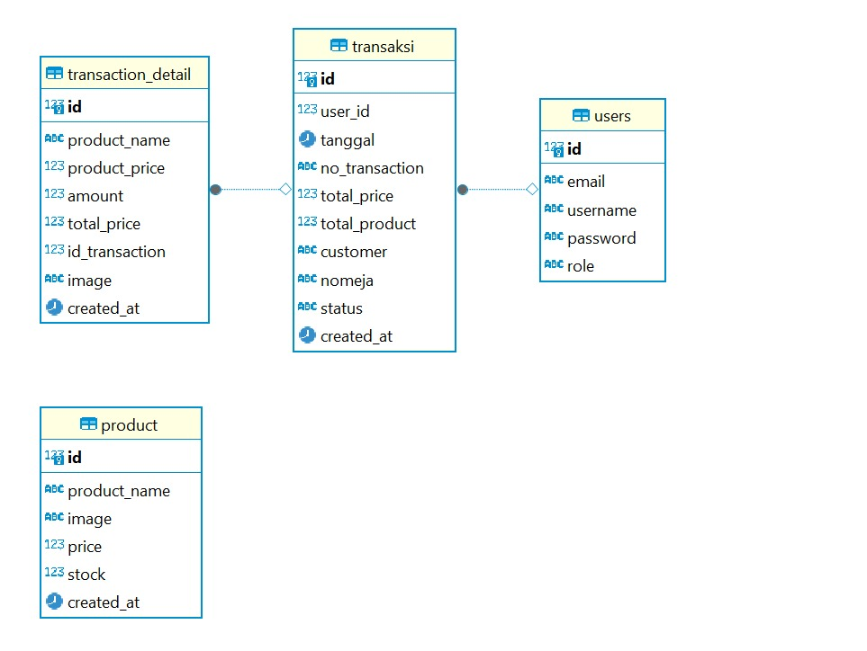

# Nebula Espresso

Nebula Espresso adalah sebuah aplikasi web untuk toko kopi yang dapat mempermudah pengguna untuk melihat dan memesan berbagai jenis kopi. Aplikasi web  ini  juga menyediakan informasi tentang berbagai jenis kopi yang dijual, termasuk gambar, harga, dan ketersediaan stok.

## Fitur
- Penampilan produk: Pengguna dapat melihat daftar produk kopi yang tersedia beserta nama, gambar, harga.
- Pemesanan: Pengguna dapat memesan produk kopi yang mereka inginkan.
- Penambahan produk ke keranjang belanja.
- Pembayaran: Pengguna dapat melakukan pembayaran untuk pesanan mereka.
- Manajemen Stok: Admin memiliki akses khusus untuk menambahkan dan menghapus produk kopi.
- Riwayat Pesanan: admin dan kasir  dapat melihat riwayat serta detail  pesanan konsument

## Diagram ER

## Tech stack
- Frontend: React.js
- Backend: Node.js, Express.js
- Database:PostgreSQL
- Hosting: Heroku
- Version Control: Git, GitHub